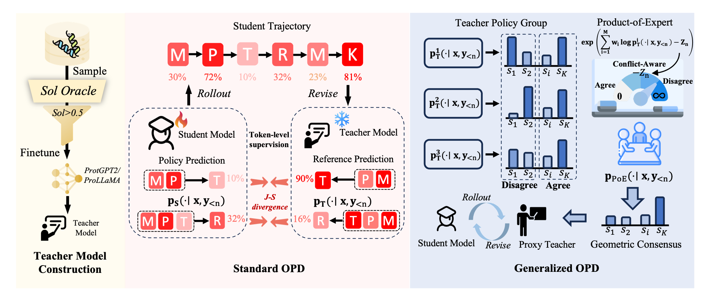

# ProteinOPD

Paper: [ProteinOPD: Towards Effective and Efficient Preference Alignment for Protein Design](https://arxiv.org/abs/2605.10189)

Project page: [https://thu-ai4s.github.io/ProteinOPD/](https://thu-ai4s.github.io/ProteinOPD/)

ProteinOPD currently contains two training and generation tracks:

- `unconditional`: ProtGPT2 prefix-tuning teacher construction, ProtGPT2 geometric ProteinOPD training, and unconditional generation.
- `conditional`: ProLLaMA LoRA instruction-tuning teacher construction, ProLLaMA geometric ProteinOPD training, and conditional generation.

## Pipeline



## Colab Notebooks
- [Inference](notebooks/proteinopd_inference.ipynb): the recommended Colab entry point for generating protein sequences from the released unconditional and conditional multi-preference aligned adapters.
[](https://colab.research.google.com/github/THU-AI4S/ProteinOPD/blob/main/notebooks/proteinopd_inference.ipynb)

## Environment Setup

Create the conda environment from `environment.yml`:

```bash
conda env create -f environment.yml
conda activate proteinopd
```

`environment.yml` uses `pytorch-cuda=12.1` by default. If your server driver or cluster image requires another CUDA version, edit the `pytorch-cuda` version in `environment.yml` before creating the environment.

Check the core dependencies after installation:

```bash
python -c "import torch, transformers, datasets, peft, accelerate, yaml; print('torch', torch.__version__)"
```

## ProtGPT2 Prefix Teacher Construction

Edit the configuration file:

```text
unconditional/teacher_construct/prefix_tuning_prot.yaml
```

Run:

```bash
python unconditional/teacher_construct/prefix_tuning_prot.py \
  --config unconditional/teacher_construct/prefix_tuning_prot.yaml
```

The input CSV files must contain the sequence column specified by `text_column`; the default is `sequence`. The output is a PEFT prefix adapter.

## ProLLaMA LoRA Teacher Construction

Edit the model, data, and output paths in:

```text
conditional/teacher_construct/scripts/run_it_lora_multigpu.sh
```

Run:

```bash
bash conditional/teacher_construct/scripts/run_it_lora_multigpu.sh
```

The training data should be instruction JSON/JSONL with `instruction`, `input`, and `output` fields. The output is a ProLLaMA LoRA adapter.

## ProtGPT2 Geometric ProteinOPD

Edit the teacher configuration:

```text
unconditional/proteinopd/configs/teachers.yaml
```

Run:

```bash
bash unconditional/proteinopd/scripts/run_protein_opd_ddp.sh
```

## ProLLaMA Geometric ProteinOPD

Edit the configuration file:

```text
conditional/proteinopd/configs/prollama_protein_opd_example.yaml
```

Run:

```bash
bash conditional/proteinopd/scripts/run_prollama_protein_opd_ddp.sh
```

## Generation

ProtGPT2 unconditional generation:

```bash
python unconditional/generate/generate.py \
  --config unconditional/generate/generate.yaml
```

ProLLaMA conditional generation:

```bash
python conditional/generate/generate.py \
  --config conditional/generate/generate.yaml
```

Both `generate.py` scripts read `generate.yaml` from the same directory by default.
